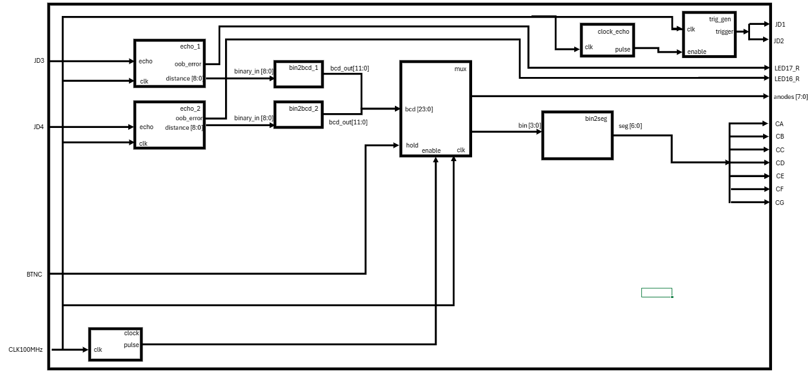

# Ultrasound sensor controller HS-SR04
## Team members
- Emanuel Antol : sensor_read.vhd, Hardware setup, Debugging, Readme file
- Jan Konkolský : topLevel.vhd, pulse_enable.vhd, Debugging
- Vojtěch Trunda : bcd_mux.vhd, Debugging, Hardware setup
- David Karas : bin_bcd.vhd, Documentation, Readme file

### Project Overview
The objective of this project was to develop a controller for HC-SR04 ultrasonic sensors. After a thorough discussion among all team members, we agreed on a clear implementation goal.

Our aim was to measure distances using two separate HC-SR04 ultrasonic sensors and simultaneously display both measurements in centimeters on two individual seven-segment display "modules". Based on prior experience with the HC-SR04, we were aware that its accuracy decreases near the edges of its measurement range. To address this limitation, we decided to include an error indicator in our system. This indicator notifies the user when a measured distance falls outside the reliable, customizable operating range of the sensor—either too close or too far to be considered accurate or stable.

The following sections describe our final hardware and software solutions designed to meet these objectives.

## Hardware Setup and Sensor Integration

For background functionality, we used the Nexys A7-50T FPGA development board, while an Arduino UNO served as a power supply for the HC-SR04 sensors, since the Nexys A7-50T does not provide the required 5V output. A breadboard was used to connect all components, as it simplifies prototyping and testing.

Because the HC-SR04's "echo" pin outputs a 5V signal—exceeding the voltage tolerance of the Nexys A7-50T—we implemented a voltage divider to step the signal down to a safe level.

For final testing, the following configuration was used (see images below):
The "echo" output pin of the first sensor was connected to port JD3 (JD4 for the second sensor), while the "trigger" input was connected to JD1 (JD2 for the second sensor) on the Nexys A7-50T development board.

  
  

## Software Architecture and Implementation

To support efficient testing and collaboration, we designed the software to be as modular as possible.  
This modular approach allowed for individual components to be developed and tested independently, which proved instrumental in identifying and resolving bugs during the final top-level integration.
It also makes our solution easily adaptable to support more or fewer sensors (and displays).

The software solution is divided into three main parts to clearly illustrate its functionality:

1. **Sensor Reading and Supporting Components**  
     - Responsible for interfacing with the HC-SR04 ultrasonic sensors and handling the timing logic required to measure and convert pulse widths into distance values (in cm) accurately. It also includes error indication for distances that fall outside the reliable operating range.
     - Components: sensor_readv2.vhd, pulse_enable.vhd, clock_en.vhd

2. **Data Conversion**  
     - Converts binary distance values into BCD format suitable for driving seven-segment displays.
     - Components: bin_bcd.vhd

3. **Data Displaying**  
     - Manages multiplexing of the output to the seven-segment displays, ensuring that all sensor measurements are shown simultaneously and without visible flickering.
     - Components: bcd_mux.vhd, bin2seg.vhd, clock_en.vhd
  
The following section describes the individual components of the final software implementation.

### Top_level
The top_level component is used to integrate all individual modules and connect their inputs and outputs to the corresponding pins on the development board. It also defines the generic parameters for all applicable components. You can see all the individual components in the top_level diagram, in the image below.

### sensor_read

The `sensor_readv2` component functions as a finite state machine with three states: **Waiting**, **Counting**, and **Write**. It is responsible for measuring the width of the pulse received from the HS-SR04’s echo pin, converting it into a binary distance value, and sending it to the [bin_bcd](#bin_bcd) component. The sensor is calibrated to an ambient temperature of 20°C, although this can be easily adjusted.

The component also includes an echo signal synchronizer and a "debouncer" to ensure accurate readings from the sensor, even when the falling or leading edges of the echo signal are distorted.

If the measured distance falls outside the acceptable range, the component will trigger an error signal. Distance bounds are customizable through generic component parameters. Specific software mechanisms for this component are documented in comments directly within the source <a href="source/ProjektDE1/ProjektDE1.srcs/sources_1/imports/256762/Sensor_readv2.vhd">file</a>.

![[tb_sensor_readv2.png]](img/tb_sensor_readv2.png)

### bin_bcd

The <code>bin_bcd.vhd</code> component is used to convert the binary distance measured in the <a href="#sensor_read.vhd">sensor_read</a> component into BCD code. This BCD code is then sent to the <a href="#bcd_mux.vhd">bcd_mux</a> component. By converting the binary value to BCD, further logic can directly work with the digits that will be displayed on the seven-segment display, simplifying the complexity of code in subsequent components.

We defined two ports: <code>binary_in</code> and <code>bcd_out</code>.  
To convert the binary value to BCD, we used the <strong>Shift-Plus-Three</strong> algorithm. The algorithm processes the first 4 bits of the binary value and compares them to see if they are greater than 4 (in binary). If the value is greater than 4, we add 3 (in binary) to the <code>bcd_value</code> and then proceed to the next 4 bits.  

You can find the code for this component <a href="source/ProjektDE1/ProjektDE1.srcs/sources_1/imports/256762/bin_bcd.vhd">here</a>, and a reference to the algorithm [here](https://github.com/EmanuelAntol/DE1/edit/main/README.md#references).

![[bin_bcd.png]](img/bin_bcd.png)

### bcd_mux
The bcd_mux component is a multiplexor used to take the input bcd value from 2 sensors and display them on the seven segment display at the same time.
It takes one half of the inputing bcd values and decides, if it should display it on the right or left seven segment display, by enabling cathodes on the Nexys board. 
From this half of the bcd value it takes group of 4 binary values and assigns them to the binary output, which is then used in the [bin2seg](#bin2seg).

![[tb_bcd_mux.png]](img/tb_bcd_mux.png)

This component also incorporates hold function that is used to hold the current displayed value on the display, if we hold the center button. 

### bin2seg
The bin2seg component is used to convert the inputing distance value and display it on the 7 segment display. 

### pulse_enable
The pulse_enable component sends 15 us wide pulse to the HS-SR04‘s trigger pin, which will start measuring proces. This component is dependant on the clock signal. If the clock signal is 0 it will not activate the HS-SR04 sensor.

### clock_en
The clock_en component is used to supply clock signal to components that require clock signal. Components which require clock signal: [pulse_enable](#pulse_enable), [sensor_read](#sensor_read) and [bcd_mux](#bcd_mux) 

## References

1. Inspiration for the bin_bcd component: https://piembsystech.com/binary-to-bcd-conversion-in-vhdl-programming-language/
2. Bin2seg and clock_en components reused from Digital electronics course repository https://github.com/tomas-fryza/vhdl-labs/tree/master
